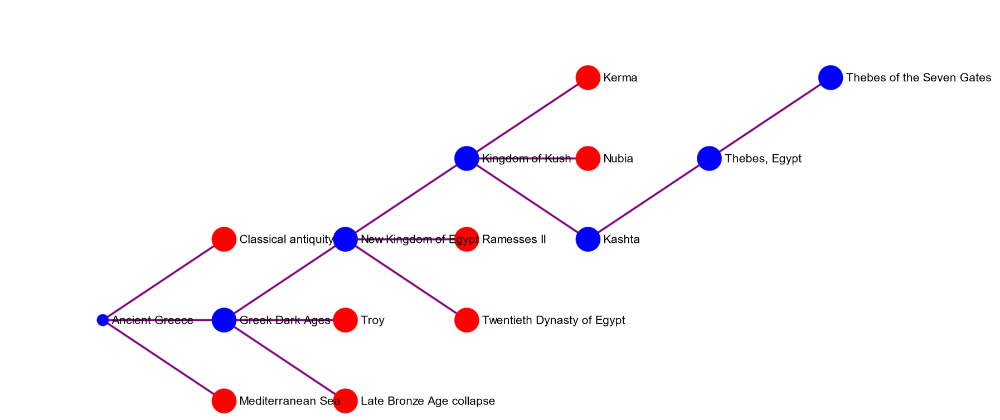

# HistoryLinks
 

## Toy #1

## Future Ideas
- Some way to filter graph based on location (NYC), people, events, stories (King Arthur)
- Any way to see how things have changed over time for example how has Paris changed from the earliest records to modern day, see how King Arthur has changed from first mention to modern day stories
- Filter particular portion of dataset to reduce how much is deployed at a time? Segmenting 500M rows into more manageable chunks that are relevant to specific fields/areas of interest
